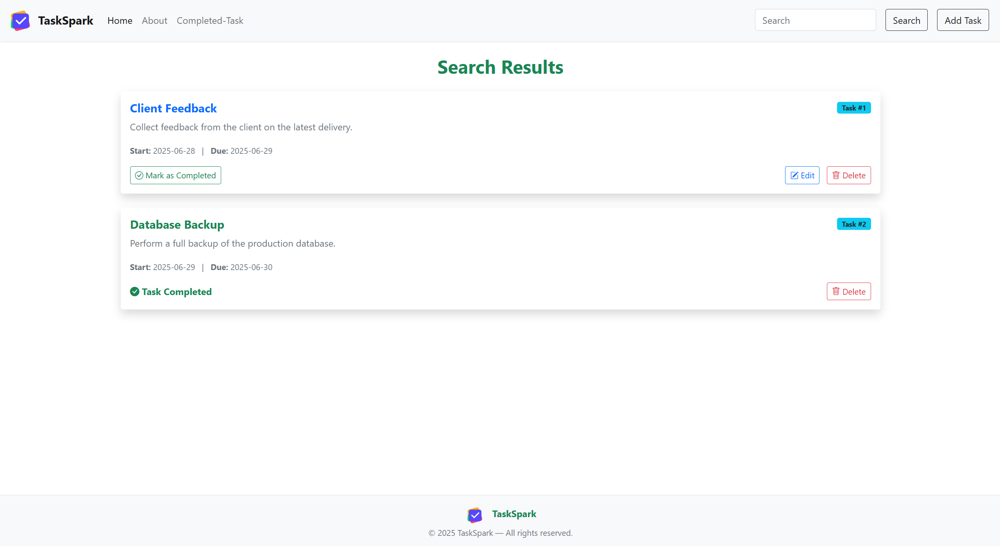

# 🚀 TaskSpark - Your Personal Todo Assistant


**TaskSpark** is a sleek and modern Todo Web Application built with **Node.js**, **Express**, **MySQL**, and **Bootstrap**.  
It helps users manage their tasks efficiently with features like email notifications, task categorization, sub-tasks, completion tracking, and more.

---

## 🌟 Features

- ✅ Create, Edit, and Delete Tasks
- 📩 Email Notification on Task Creation
- 🔍 Search Functionality
- ✅ Task Completion Toggle
- 📊 Completed Tasks View
- 🌐 Responsive UI with Bootstrap

---

## 🛠️ Tech Stack

| Layer        | Technology                         |
| ------------ | ---------------------------------- |
| Frontend     | HTML, EJS, Bootstrap 5, JS         |
| Backend      | Node.js, Express.js                |
| Database     | MySQL                              |
| Email Service| Nodemailer + Gmail App Password    |

---

## 🚀 Installation & Setup Guide
> Prerequisites :  
- Node.js, MySQL installed and running locally.

### 1. Clone the Repository :

```bash
git clone https://github.com/PranavNikam-15/TaskSpark-TodoApp.git
cd TaskSpark-TodoApp
```

### 2. Install Dependencies :

```bash
npm install express mysql ejs method-override nodemailer dotenv body-parser
```

### 3. Configure Database :

- Start MySQL server.  
- Open MySQL CLI or any GUI (MySQL Workbench).  
- Run the following SQL to create the database and table :

```sql
CREATE DATABASE todoapp;

USE todoapp;

CREATE TABLE tasks (
    id INT AUTO_INCREMENT PRIMARY KEY,
    title VARCHAR(255) NOT NULL,
    description TEXT,
    start_date DATE,
    due_date DATE,
    is_completed BOOLEAN DEFAULT FALSE,
    created_at TIMESTAMP DEFAULT CURRENT_TIMESTAMP,
    FULLTEXT (title, description)
);
```

### 4. Configure Environment Variables :

```bash
touch .env
```

```
PORT=3000

# MySQL Credentials
DB_HOST=localhost
DB_USER=root
DB_PASSWORD=your_mysql_password
DB_NAME=todoapp

# Email Credentials (Use App Passwords, not real password)
EMAIL_USER=youremail@gmail.com
EMAIL_PASS=your_app_password
EMAIL_RECIPIENT=recipient@gmail.com
```

### 5. Generate Gmail App Password :

> Ensure that 2-Step Verification is enabled on your Google account.  
If not, go to: https://myaccount.google.com/security

> Go to your Google Account App Passwords page  
https://myaccount.google.com/apppasswords  
(You may be prompted to log in again)

> Under "Select the app", choose:  
App → Mail  
Device → Other (Custom name) → Type: TaskSpark (or anything)  
Click "Generate"  
Copy the 16-character app password shown


## 📸 Screenshots

### 📋 Task List View  


### ✔️ Completed Tasks  


### ℹ️ About Page  


### 🔔 Add Task Page  


### 🔍 Search Task Page


---

## 📜 License

This project is licensed under the [MIT License](LICENSE).